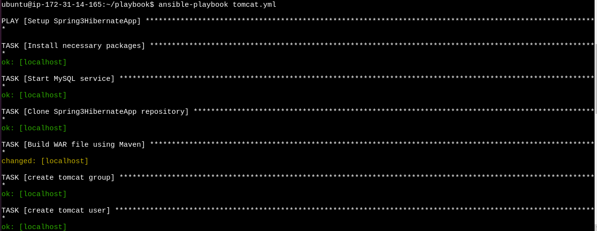
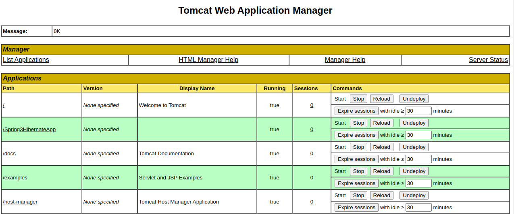
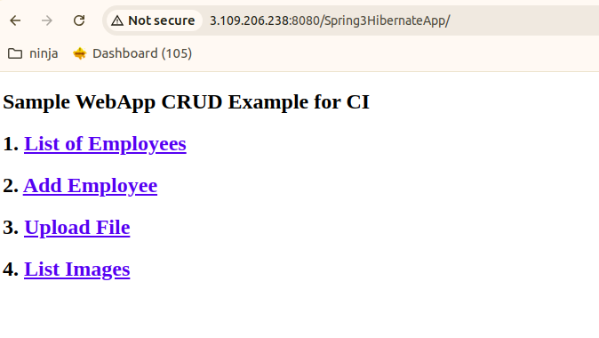

#  Ansible playbook
An Ansible Playbook is a configuration management and automation tool used to define and execute a set of tasks on remote systems. Written in YAML (Yet Another Markup Language), a playbook contains a series of "plays," which map hosts (or groups of hosts) to specific tasks to be executed.


 #  Run  commands based on the following conditions:
## 1. To execute the playbook.
- Run the following  command

   - ``` ansible-playbook tomcat.yml ```




## 2. Then go to the browser.
- Run the following  command

   - ``` <your_server_ip:8080> ```


## 3. Then go to Manager app.




## 4. Then go to /Spring3HibernateApp.



